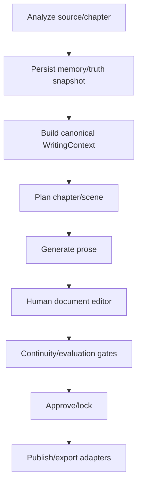

# Writing Pipeline Canonical Map

Issue: #7, #72
Parent epic: #2
Status: Post-baseline verified
Last updated: 2026-05-07

Evidence sources:

- PR #10 landed the chapter-first V3 stabilization foundation.
- PR #14 landed the V3 runtime proof fix and migration baseline squash.
- Fresh baseline replay was verified on 2026-05-02 against `db/migrations/000_baseline_20260502.sql`.

## Decision Summary

Proposed canonical direction:

```text
analysis -> memory/truth snapshot -> chapter/scene planning -> prose generation -> document editing -> continuity validation -> approval/lock -> publishing handoff
```

Approved assumptions:

- The chapter-first files in the current working tree are real product direction, not scratch work.
- `CHAPTER_WRITE_V3 -> CHAPTER_LEDGER_EXTRACT -> MEMORY_ROLLUP_V3` is the near-term canonical automated prose path.
- `000_baseline_20260502.sql` is the active fresh-DB baseline while historical migrations are reference-only archive files.
- Future generated prose source of truth should be document/chapter blocks, not `narrative_scene_version`.
- `narrative_scene_version` remains compatibility/history until the editor model exists.
- `WorkflowEngine` and `versionRepo.ts` are treated as dormant legacy unless a later route/UI trace proves active usage.
- Python worker/handlers are the long-term owner for narrative runtime execution. Studio TypeScript owns UI/API transport, DTO mapping, enqueue/status orchestration, and compatibility readers.

Canonical narrative runtime ownership should follow the chapter-first flow that creates durable chapter draft output through Python-handled `CHAPTER_WRITE_V3`, then later bridges approved prose into the editor and scene/version model. The current scene workflow remains necessary as compatibility and manual scene-version tooling, but it is not a complete automated writing pipeline.

## Approval Decisions And Remaining Checks

These decisions resolve the main #2 approval blockers. Remaining checks are evidence-gathering safeguards before implementation, not blockers to approving the direction.

| Item | Decision | Remaining check | Current evidence |
|---|---|---|---|
| `VersionRepo.createVersion` durable write path | Treat `WorkflowEngine` and `versionRepo.ts` as dormant legacy / deprecate. | Do one final route/UI trace before any deletion task. | `git grep` finds `VersionRepo.createVersion` used only by `workflowEngine.ts`; `git grep WorkflowEngine` finds no tracked call sites outside its own file. |
| Chapter-first writing-related files | Treat chapter-first writing files as intended product direction. | Complete; #9 and #13 have landed. | PR #10 stabilized the product files; PR #14 carried the runtime proof fix and baseline into `staging`. |
| Kept surfaces mapped to flow steps | Approve current `Canonical Flow Integration Map` as the working integration contract. | Correct only if implementation evidence contradicts the map. | Added below. |
| `NARRATIVE_*` fate | Merge useful narrative stages into Python-owned `CHAPTER_WRITE_V3` internals; do not keep as a separate public pipeline. | `NARRATIVE_CRITIC/REFINE` behavior is carried forward as bounded internal `CHAPTER_WRITE_V3` review/refine passes. Public Python dispatch is retired by default; set `NARRATIVE_LEGACY_DISPATCH_ENABLED=1` only to drain compatibility jobs. | TS and Python both contain legacy `NARRATIVE_*` execution surfaces; Python worker is the approved runtime owner because it already owns task dispatch, LLM calls, prompt hydration traces, semantic memory retrieval, and V3 ledger/rollup chaining. |
| Prose source of truth | Future source of truth is document/chapter blocks; `narrative_scene_version` is compatibility/history. | #5 must define the document block schema and bridge rules. | Current writes are split across `chapter_draft`, `narrative_chapter_staging`, and `narrative_scene_version`. |

## Classification Rubric Used

- `keep`: Future canonical or required supporting surface.
- `merge`: Contains required behavior that should move into the canonical path.
- `compatibility-only`: Must remain temporarily for manual recovery, existing UI, or existing data.
- `deprecate`: Not canonical and should receive no new feature work.
- `delete`: Safe to remove after evidence and maintainer sign-off.
- `unknown / needs decision`: Evidence is incomplete; do not implement irreversible changes.

## Evidence Searches

Commands attempted or used for this inventory:

```text
rg --files apps/studio/src/app/api apps/studio/src/features/scenes apps/studio/src/features/autowrite services/memory-bridge
rg -n draft|outline|evaluate|rewrite|lock|autowrite|WRITING_|NARRATIVE_|scene_version|insertVersion|createVersion|llm|LLM|chat|completion|openai|generate|prompt|context ...
Select-String route files for exported HTTP handlers and service calls.
Select-String workflow steps for insertVersion, updateScene, buildCanonGuard, buildStoryContextPack, NARRATIVE_, WRITING_.
Select-String Python workers for process_writing*, process_narrative*, CHAPTER_WRITE_V3, call_llm_json, call_llm_text.
Select-String persistence for insert_scene_with_version, INSERT INTO public.narrative_scene_version, insertVersion, createVersion.
```

Tooling note: `rg` was not executable in this WSL/UNC session because it resolved to the Codex Windows bundle with permission denied. `find`, `grep`, and PowerShell `Select-String` were used for the actual evidence pass.

## API Route Inventory

| Surface | Route file | Handler | Next call | LLM boundary | Durable write boundary | Classification | Evidence / reason |
|---|---|---|---|---|---|---|---|
| Legacy default scene draft | `apps/studio/src/app/api/scenes/draft/route.ts` | `POST` | `postScenesDraftResponse(req, "default")` -> `runDraft` | No direct LLM; stores provided text with guard block | `repoScene.insertVersion` -> `narrative_scene_version`; `updateScene` | compatibility-only | Default-story alias of story-scoped scene workflow; emits deprecation headers until `2026-06-07`; needed for old UI/manual tools, not canonical automation. |
| Story scene draft | `apps/studio/src/app/api/[storySlug]/scenes/draft/route.ts` | `POST` | `postScenesDraftResponse` -> `runDraft` | No direct LLM | `repoScene.insertVersion` | compatibility-only | Manual scene version creation remains useful, but generated writing should not start here. |
| Legacy default scene outline | `apps/studio/src/app/api/scenes/outline/route.ts` | `POST` | `postScenesOutlineResponse` -> `runOutline` | No direct LLM | `repoScene.insertVersion` with beats | compatibility-only | Stores outline/beats for scene workflow only. |
| Story scene outline | `apps/studio/src/app/api/[storySlug]/scenes/outline/route.ts` | `POST` | `postScenesOutlineResponse` -> `runOutline` | No direct LLM | `repoScene.insertVersion` with beats | compatibility-only | Keep only while scene workflow UI exists. |
| Legacy default scene evaluate | `apps/studio/src/app/api/scenes/evaluate/route.ts` | `POST` | `postScenesEvaluateResponse` -> `runEvaluate` | No direct LLM; stub eval builder | `repoScene.updateVersionEval`; `updateScene` | compatibility-only | Evaluation is not real LLM evaluation today. Should merge later into canonical validation. |
| Story scene evaluate | `apps/studio/src/app/api/[storySlug]/scenes/evaluate/route.ts` | `POST` | `postScenesEvaluateResponse` -> `runEvaluate` | No direct LLM; stub eval builder | `repoScene.updateVersionEval`; `updateScene` | merge | Validation concept belongs in canonical flow, current implementation is too local/stubbed. |
| Legacy default scene rewrite | `apps/studio/src/app/api/scenes/rewrite/route.ts` | `POST` | `postScenesRewriteResponse` -> `runRewrite` | No direct LLM; local transform when mode is `llm` | `repoScene.insertVersion`; `updateScene` | compatibility-only | Name suggests LLM rewrite but code builds local rewrite text; keep for manual recovery only. |
| Story scene rewrite | `apps/studio/src/app/api/[storySlug]/scenes/rewrite/route.ts` | `POST` | `postScenesRewriteResponse` -> `runRewrite` | No direct LLM | `repoScene.insertVersion`; `updateScene` | merge | Rewrite UX is needed, but should merge into editor/canonical revision model. |
| Legacy default scene lock | `apps/studio/src/app/api/scenes/lock/route.ts` | `POST` | `postScenesLockResponse` -> `runLock` | None | `repoScene.updateScene(status=LOCKED)` | keep | Approval/lock is a required canonical concept, though implementation may move. |
| Story scene lock | `apps/studio/src/app/api/[storySlug]/scenes/lock/route.ts` | `POST` | `postScenesLockResponse` -> `runLock` | None | `repoScene.updateScene(status=LOCKED)` | keep | Approval/lock should remain conceptually canonical. |
| Story scene unlock | `apps/studio/src/app/api/[storySlug]/scenes/unlock/route.ts` | `POST` | `postScenesUnlockResponse` -> `runUnlock` | None | `repoScene.updateScene(status=DRAFTING)` | compatibility-only | Manual lifecycle tool; useful but not a canonical generation step. |
| Scene intake | `apps/studio/src/app/api/scenes/intake/route.ts`, `apps/studio/src/app/api/[storySlug]/scenes/intake/route.ts` | `POST` | `postScenesIntakeResponse` -> `runIntake` | None | `getOrCreateSceneByWorkunit` -> `narrative_scene` | compatibility-only | Scene creation helper for current UI, not full writing pipeline. Default `/api/scenes/*` variants are deprecated aliases for story slug `default`; canonical callers use `/api/[storySlug]/scenes/*`. |
| Scene versions read | `apps/studio/src/app/api/scenes/[sceneId]/versions/route.ts`, `apps/studio/src/app/api/[storySlug]/scenes/[sceneId]/versions/route.ts` | `GET` | `getSceneVersionsResponse` | None | Read-only | keep | Required history/read surface for scene version model. |
| Commit draft | `apps/studio/src/app/api/scenes/[sceneId]/commit-draft/route.ts`, `apps/studio/src/app/api/[storySlug]/scenes/[sceneId]/commit-draft/route.ts` | `POST` | commit handler in `scenesApiService` | None | `runDraft` / scene-version write path | compatibility-only | Manual editor commit bridge; should later merge with document editor approval. |
| Autowrite v1 run | `apps/studio/src/app/api/[storySlug]/autowrite/run/route.ts` | `POST` | `postAutowriteRunResponse` | Direct TS LLM via `callChatCompletionJson` | Saves final prose through `runDraft` -> `insertVersion` | deprecate | Duplicates writer/critic/judge loop outside worker pipeline and canonical context contract. |
| Legacy autowrite analysis | `apps/studio/src/app/api/[storySlug]/autowrite/pipeline/analysis/route.ts` | `POST` | `createWritingAnalysisTask` | Python worker LLM later | `ingest_job`, `ingest_task(WRITING_ANALYSIS)` | merge | Contains useful analysis/task enqueue path but competes with chapter-first V3. |
| Legacy autowrite execute | `apps/studio/src/app/api/[storySlug]/autowrite/pipeline/execute/route.ts` | `POST` | `executeWritingPhase` | Python worker LLM later | `ingest_task(WRITING_PROSE)` | merge | Concept of approved plan -> prose task belongs in canonical orchestration, current path is legacy. |
| Chapter auto-write | `apps/studio/src/app/api/stories/[slug]/chapters/[chapterId]/auto-write/route.ts` | `POST`, `GET` | `postChapterAutoWriteResponse` -> `runChapterPlanning` -> `runChapterWriting`; `GET` -> `getChapterWritingStatusResponse` | TS planning LLM first, Python worker later | `ingest_job`, `ingest_task(NARRATIVE_START)` today; local V3 changes route autowrite pipeline to `CHAPTER_WRITE_V3` | keep | Best candidate canonical entry for automated chapter writing, but current committed route still launches narrative writing through `scenesApiService`. |
| Chapter auto-write retry/status | `apps/studio/src/app/api/stories/[slug]/chapters/[chapterId]/auto-write/retry/route.ts`, `.../status/route.ts` | `POST`, `GET` | story API service / status handlers | Python worker LLM later | Worker task/status tables | keep | Operational support for chapter-first generation. |
| Chapter plan | `apps/studio/src/app/api/stories/[slug]/chapters/[chapterId]/plan/route.ts` | `POST` | `postChapterPlanResponse` -> `runChapterPlanning` | Direct TS LLM via `callChatCompletionJson` inside planning step | No durable prose; returns plan and conflict metadata | keep | Explicit planning entry for current AutoWrite wizard; should consume canonical `WritingContext` after #3. |
| Chapter execute | `apps/studio/src/app/api/stories/[slug]/chapters/[chapterId]/execute/route.ts` | `POST` | `postChapterExecuteResponse` -> `runChapterWriting` | Python worker LLM later | `ingest_job`, `ingest_task(NARRATIVE_START)` | merge | Explicit plan-to-write route, but it launches the narrative task path that should be merged under `CHAPTER_WRITE_V3` or document-block generation. |
| Chapter execute control | `apps/studio/src/app/api/stories/[slug]/chapters/[chapterId]/execute/control/route.ts` | `POST` | `postChapterExecuteControlResponse` | None | Updates `ingest_job` and `ingest_task` status to `PAUSED` or `CANCELLED` | keep | Operational control for long-running chapter jobs. |
| Muse prose/synthesis/compress | `apps/studio/src/app/api/muse/chat/prose/route.ts`, `synthesis/route.ts`, `compress/route.ts` | `POST` | `callChatCompletionJson` | Direct TS LLM | No durable prose write by route | compatibility-only | Editor assist path, not canonical autonomous writing; should later belong to document editor assist. |
| Draft stream pipeline | `apps/studio/src/app/api/pipeline/draft/stream/route.ts` | `POST` | `postDraftStreamResponse` -> `parseDraftStreamRequest` -> `buildCanonGuard` when `story_slug` exists -> `fetchUpstreamWithFallback` | Direct streaming proxy to `${LLM_API_BASE}/chat/completions` | No durable write; SSE response only | compatibility-only | Active editor ghost-writing assist via `useDraftGhost`; not canonical autonomous generation or persistence. |

## TypeScript Service Inventory

| File | Functions / responsibility | Next call | LLM boundary | DB write boundary | Classification | Evidence / reason |
|---|---|---|---|---|---|---|
| `apps/studio/src/features/scenes/server/scenesApiService.ts` | API facade for scenes, chapter planning/writing, ingest/split bridge | Calls `runDraft`, `runOutline`, `runRewrite`, `runEvaluate`, `runLock`, `runUnlock`, `runChapterPlanning`, `runChapterWriting` | Indirect via chapter planning/writing | Multiple direct `INSERT`/`UPDATE` into source docs, ingest jobs/tasks, staging | merge | Too broad; should be split by canonical orchestration, scene lifecycle, and ingest bridge. |
| `apps/studio/src/features/scenes/server/workflow/steps/draft.ts` | `runDraft` writes a draft scene version with canon guard block | `buildCanonGuard`, `insertVersion`, `updateScene` | No direct LLM | `narrative_scene_version`, `narrative_scene` | compatibility-only | Good manual version writer; not autonomous writing. |
| `apps/studio/src/features/scenes/server/workflow/steps/outline.ts` | `runOutline` writes outline/beats version | `insertVersion`, `updateScene` | No direct LLM | `narrative_scene_version`, `narrative_scene` | compatibility-only | Manual scene-outline storage. |
| `apps/studio/src/features/scenes/server/workflow/steps/evaluate.ts` | `runEvaluate` stores stub eval JSON | `updateVersionEval`, `updateScene` | No direct LLM | `narrative_scene_version.eval_json`, `narrative_scene` | merge | Validation concept needed, implementation should be replaced by canonical evaluator. |
| `apps/studio/src/features/scenes/server/workflow/steps/rewrite.ts` | `runRewrite` creates revised version from current text/manual text | `buildCanonGuard`, `insertVersion`, `updateScene` | No direct LLM | `narrative_scene_version`, `narrative_scene` | merge | Rewrite belongs to editor/revision model. |
| `apps/studio/src/features/scenes/server/workflow/steps/lock.ts` | `runLock` sets scene status locked | `updateScene` | None | `narrative_scene.status` | keep | Approval/lock concept remains canonical. |
| `apps/studio/src/features/scenes/server/workflow/steps/unlock.ts` | `runUnlock` returns locked scene to drafting | `updateScene` | None | `narrative_scene.status` | compatibility-only | Operational/manual lifecycle only. |
| `apps/studio/src/features/scenes/server/workflow/steps/intake.ts` | `runIntake` creates/fetches scene by workunit | `getOrCreateSceneByWorkunit` | None | `narrative_scene` | compatibility-only | Scene shell creation utility. |
| `apps/studio/src/features/scenes/server/workflow/steps/chapterPlanning.ts` | `runChapterPlanning`, `buildPlanningMemoryPackV5`, `renderPlanningPrompt` | `buildStoryContextPack`, `callChatCompletionJson` | Direct TS LLM | No durable prose; reads snapshots/context | keep | Planning is part of canonical flow; should consume future `WritingContext`. |
| `apps/studio/src/features/scenes/server/workflow/steps/chapterWriting.ts` | `runChapterWriting` enqueues `NARRATIVE_START` | `ensureIngestWorkerRunning` | Python worker later | `ingest_job`, `ingest_task` | merge | Launches narrative worker flow but overlaps `writingPipelineService.enqueueChapterWriteV3`. |
| `apps/studio/src/features/scenes/server/workflow/repoScene.ts` | Scene repository and active TS `insertVersion` | SQL queries | None | Active `narrative_scene_version` write | keep | Current durable scene-version writer. |
| `apps/studio/src/features/scenes/server/workflow/versionRepo.ts` | Alternate `VersionRepo.createVersion` | SQL insert | None | Alternate `narrative_scene_version` write without `story_id` | deprecate | Approved assumption: `WorkflowEngine` and this repo are dormant legacy unless final route/UI trace proves active usage. Do not delete without a child task. |
| `apps/studio/src/features/autowrite/server/autowriteRunService.ts` | Direct writer/critic/judge autowrite loop | `buildStoryContextPack`, prompt builders, `callChatCompletionJson`, `runDraft` | Direct TS LLM, multiple calls | Final save through `runDraft` -> `insertVersion` | deprecate | Duplicate generation path outside canonical worker/task model. |
| `apps/studio/src/features/autowrite/server/writingPipelineService.ts` | Legacy and V3 task orchestration | Enqueues `WRITING_*`, `NARRATIVE_*`; #9 routes the V3 flag to `enqueueChapterWriteV3` and chains `CHAPTER_WRITE_V3` -> `CHAPTER_LEDGER_EXTRACT` -> `MEMORY_ROLLUP_V3` | Python worker later | `ingest_job`, `ingest_task`, some staging/status tables | merge | Contains key orchestration but has multiple competing flows in one file. V3 changes support the approved direction and are stabilized by #9. |
| `apps/studio/src/features/autowrite/server/narrativeWorkerService.ts` | TS poller for `NARRATIVE_%` tasks | `processNarrativeTask` | TS executor later | `ingest_task` status | deprecate | Competes with Python worker, which also handles `NARRATIVE_*`. |
| `apps/studio/src/features/autowrite/server/narrativeTaskExecutor.ts` | TS executor for `NARRATIVE_*` tasks | `buildStoryContextPack`; local placeholder prose steps | No real external LLM in this pass | `narrative_chapter_staging`, `ingest_task`, `ingest_job` | deprecate | Duplicate implementation of Python narrative handlers. |
| `apps/studio/src/features/autowrite/server/chapterContextService.ts` | `buildWorkingSet` for chapter context | DB reads from `story_series`, style profile, canon facts, milestones, chapter ledger | None | Read-only | merge | Local working-tree file; context assembly should feed canonical `WritingContext`. |
| `apps/studio/src/features/autowrite/server/chapterFirstTypes.ts` | Chapter-first type definitions for drafts, ledgers, issues | Type-only | None | None | keep | Local working-tree file; likely seed evidence for #3/#5 types but not final central schema by default. |
| `apps/studio/src/features/autowrite/server/virtualSceneProvider.ts` | Parses virtual scenes from chapter draft text | Called by modified `scenesApiService` list bridge | None | Read-only | compatibility-only | Local working-tree bridge for V3 draft display in legacy scene UI. |

## Python Worker Inventory

| Task / surface | File | Function | Data received | Data emitted / writes | LLM boundary | Classification | Evidence / reason |
|---|---|---|---|---|---|---|---|
| Worker dispatch | `services/memory-bridge/memory_bridge_worker.py` | `run_worker` task switch | `ingest_task.payload_json` | Marks task done/failed through repo helpers | Indirect | keep | Central Python boundary for task execution; #9 dispatches `CHAPTER_WRITE_V3`, `CHAPTER_LEDGER_EXTRACT`, and `MEMORY_ROLLUP_V3`. |
| Task claiming and scene persistence | `services/memory-bridge/worker_ingest_repo.py` | `claim_next_task`, `insert_scene_with_version`, `mark_task_*` | DB task rows | `narrative_scene`, `narrative_scene_version`, task status | None | keep | Active DB boundary; writes scene versions during ingest/split path. |
| `WRITING_ANALYSIS` | `services/memory-bridge/worker_task_handlers.py`, `worker_writing_analysis.py` | `process_writing_analysis_task` -> analysis helpers | instructions, chapter_id, profile/policy/context | `writing_analysis_staging`, `writing_snapshot_v3`, follow-up tasks | `call_llm_json` | merge | Strong analysis and snapshot behavior, but tied to legacy autowrite flow. |
| `WRITING_PLANNING` | `worker_task_handlers.py`, `worker_writing_planning.py` | `process_writing_planning_task`, `generate_beat_map` | analysis_result, instructions | `ingest_task.result_json` with plan | `call_llm_json` | merge | Planning concept needed, but TS `runChapterPlanning` also exists. |
| `WRITING_PROSE` | `worker_task_handlers.py`, `worker_writing_prose.py` | `process_writing_prose_task`, `generate_prose_with_snapshot` | beat, scene info, truth context pack | `ingest_task.result_json` prose | `call_llm_json` | merge | Prose generation concept needed, but output does not directly own final document model. |
| `WRITING_CONTINUITY` | `worker_task_handlers.py`, `worker_writing_continuity.py` | `process_writing_continuity_task` | prose result and continuity state | `narrative_scene_state`, task result | `call_llm_json` | merge | Continuity validation belongs in canonical flow. |
| `WRITING_SUPERVISOR` | `worker_task_handlers.py`, `worker_writing_supervisor.py` | `process_writing_supervisor_task` | pipeline results | task result/supervisor output | `call_llm_json` | merge | Supervision/evaluation needed but should be unified with canonical gates. |
| `CHAPTER_WRITE_V3` | `worker_task_handlers.py`, `worker_chapter_writer.py` | `process_chapter_write_v3_task`, `generate_chapter_v3` | `chapter_id`, `chapter_goal`, `working_set`, `style_options` | `chapter_draft` upsert with `full_text`, `status='DRAFT'`, `metadata_json`; task result; internal review metadata | `call_llm_json`; bounded internal critic/refine pass may call `call_llm_json` and `call_llm_text` before final guard/save | keep | #9 implementation; canonical chapter-first generation endpoint. `NARRATIVE_CRITIC/REFINE` behavior is folded inside this owner without adding public stages. |
| `CHAPTER_LEDGER_EXTRACT` | `worker_task_handlers.py`, `worker_chapter_ledger_extractor.py`, `worker_chapter_auditor.py` | `process_chapter_ledger_task`, `extract_ledger`, `audit_chapter` | `chapter_id`, `chapter_goal`, `working_set`; loads `chapter_draft.full_text` | `chapter_ledger`, `chapter_continuity_issue`, task result | `call_llm_json` | keep | #9 implementation; required for long-story consistency and validation gates if chapter-first path is canonical. |
| `MEMORY_ROLLUP_V3` | `worker_task_handlers.py`, `worker_memory_rollup_v3.py` | `process_memory_rollup_v3_task`, `run_memory_rollup_v3` | `story_id`, `chapter_id`; loads `chapter_ledger` and prior `story_milestone` | `story_milestone` upsert; task result | No LLM in current local implementation | keep | #9 implementation; required memory progression for canonical flow. |
| `NARRATIVE_START` | `worker_narrative_handlers.py` | `process_narrative_start_task` | plan/job payload | enqueues `NARRATIVE_STYLIST` | None | compatibility-gated | Public worker dispatch is retired by default. Rollback/drain path: set `NARRATIVE_LEGACY_DISPATCH_ENABLED=1` before running worker against old queued jobs. |
| `NARRATIVE_STYLIST` | `worker_narrative_handlers.py` | `process_narrative_stylist_task` | beat payload, context block, prior prose | prose in task payload/result; enqueues critic | `call_llm_text` | compatibility-gated | Public worker dispatch is retired by default. Stylist-specific memory seeding remains `Investigate`; do not delete handler until legacy jobs are drained or archived. |
| `NARRATIVE_CRITIC` | `worker_narrative_handlers.py` | `process_narrative_critic_task` | prose and rubric/context | critique result; may enqueue refine | `call_llm_json` | compatibility-gated | Useful behavior has a V3 home as internal `CHAPTER_WRITE_V3_CRITIC`; public worker dispatch is retired by default with env rollback for old jobs. |
| `NARRATIVE_REFINE` | `worker_narrative_handlers.py` | `process_narrative_refine_task` | prose + critique | refined prose; enqueues next/finalize | `call_llm_text` | compatibility-gated | Useful behavior has a V3 home as one-pass internal `CHAPTER_WRITE_V3_REFINE`; public worker dispatch is retired by default with env rollback for old jobs. |
| `NARRATIVE_FINALIZE` | `worker_narrative_handlers.py` | `process_narrative_finalize_task` | final prose payload | `narrative_chapter_staging` | None | compatibility-gated | Public worker dispatch is retired by default. Old staging writes are available only through explicit compatibility drain mode. |

## Context And Prompt Builders

| File | Function(s) | Inputs covered | LLM-facing output | Classification | Notes |
|---|---|---|---|---|---|
| `apps/studio/src/features/guard/server/storyContextBuilder.ts` | `buildStoryContextPack` | worldbuilding, canon, relationships, timeline, style lines, local prose tail, bridge signals | `StoryContextPack` line arrays | merge | Important context source, but should adapt to a central `WritingContext`. |
| `apps/studio/src/features/guard/server/canonGuard.ts` | `buildCanonGuard` | `StoryContextPack`, scene/workunit, keywords, token budget | guard block with world/canon/relationship/recent events/uncertainty | merge | Guard is useful, but current string block should not be the only contract. |
| `apps/studio/src/features/prompts/server/autowritePromptBuilder.ts` | `renderAutowriteContextBlock`, writer/critic/judge prompts | story context pack and autowrite config | writer/critic/judge prompts | deprecate | Bound to autowrite v1 direct loop. Keep ideas, not path. |
| `apps/studio/src/features/prompts/server/narrativePromptBuilder.ts` | stylist/editorial prompts | chapter/beat/context inputs | narrative prompts | merge | Useful if narrative multi-agent flow is retained. |
| `apps/studio/src/features/analysis/server/truthPackGovernance.ts` | `buildPreChapterProfileV1`, `compileTruthContextPackV1` | timeline mode, author annotations, priority rules, canonical facts | truth context pack/profile | keep | Strong candidate for canonical context governance. |
| `apps/studio/src/features/scenes/server/workflow/steps/chapterPlanning.ts` | `buildPlanningMemoryPackV5`, `renderPlanningPrompt` | active snapshots, scope snapshots, scene facts, story context fallback, canon delta | planning prompt | keep | Current strongest TS planning path, but huge and should be decomposed after map approval. |
| `services/memory-bridge/worker_memory_context.py` | `build_planning_context_v5`, `build_prose_context_v5` | active snapshots, narrative scenes, scope snapshots, canon/timeline facts | Python planning/prose context dicts | merge | Python-side context duplicates TS context assembly. Must align through one contract. |
| `services/memory-bridge/worker_writing_planning.py` | `generate_beat_map` prompt construction | analysis result, instructions, dictionary rules | JSON beat map prompt | merge | Should consume canonical context. |
| `services/memory-bridge/worker_writing_prose.py` | `generate_prose_with_snapshot` prompt construction | beat, prior state, truth snapshot, dictionary rules | JSON prose prompt | merge | Should consume canonical context and write to canonical draft target. |
| `services/memory-bridge/worker_narrative_handlers.py` | narrative stylist/critic/refine prompts | task payload, context blocks, prose | text/json LLM calls | merge | Multi-agent narrative stages need ownership decision. |

## LLM Boundaries

| Boundary | File | Function | Provider call | Classification |
|---|---|---|---|---|
| TS Muse shared LLM | `apps/studio/src/app/api/muse/_shared.ts` | `callChatCompletionJson` | `fetch(${LLM_API_BASE}/chat/completions)` | keep as shared adapter; move product ownership above it |
| TS draft stream | `apps/studio/src/features/pipeline/server/draftStreamService.ts`, `draftStream/upstreamClient.ts` | `postDraftStreamResponse`, `fetchUpstreamWithFallback` | streaming `fetch(${LLM_API_BASE}/chat/completions)` with SSE passthrough | compatibility-only editor assist |
| TS chapter planning | `chapterPlanning.ts` | `runChapterPlanning` | `callChatCompletionJson` | keep |
| TS chapter writing/narrative prompts | `chapterWriting.ts` | imported prompt + `callChatCompletionJson` references | TS LLM or Python queued depending path | merge |
| TS autowrite v1 | `autowriteRunService.ts` | writer/critic/judge calls | `callChatCompletionJson` | deprecate |
| Python worker common | `services/memory-bridge/worker_common.py` | `call_llm_json`, `call_llm_text`, `call_llm_embedding` | `${DEFAULT_LLM_BASE}/chat/completions`, embeddings endpoint | keep |
| Python writing analysis | `worker_writing_analysis.py` | `_extract_candidate_facts_llm` | `call_llm_json` | merge |
| Python writing planning | `worker_writing_planning.py` | `generate_beat_map` | `call_llm_json` | merge |
| Python writing prose | `worker_writing_prose.py` | `generate_prose_with_snapshot` | `call_llm_json` | merge |
| Python continuity | `worker_writing_continuity.py` | extract/integrity calls | `call_llm_json` | merge |
| Python supervisor | `worker_writing_supervisor.py` | supervisor call | `call_llm_json` | merge |
| Python chapter V3 | `worker_chapter_writer.py` | `generate_chapter_v3` | `call_llm_json` | keep |
| Python chapter ledger/audit V3 | `worker_chapter_ledger_extractor.py`, `worker_chapter_auditor.py` | `extract_ledger`, `audit_chapter` | `call_llm_json` | keep |
| Python narrative multi-agent | `worker_narrative_handlers.py` | stylist/critic/refine | `call_llm_text`, `call_llm_json` | merge |

## Durable Write Boundaries

| Data | File | Function / SQL | Classification | Notes |
|---|---|---|---|---|
| `narrative_scene_version` active TS write | `apps/studio/src/features/scenes/server/workflow/repoScene.ts` | `insertVersion` | keep | Current scene-version commit path for draft/outline/rewrite. |
| `narrative_scene_version` alternate TS write | `apps/studio/src/features/scenes/server/workflow/versionRepo.ts` | `VersionRepo.createVersion` via `workflowEngine.ts` | deprecate | Approved dormant legacy path. Final route/UI trace required before any deletion because this is a durable write boundary. |
| `narrative_scene_version` Python ingest write | `services/memory-bridge/worker_ingest_repo.py` | `insert_scene_with_version` | keep | Used by ingest/split scene creation and `SCENE_CREATE`. |
| `chapter_draft` | `services/memory-bridge/worker_task_handlers.py` | `process_chapter_write_v3_task` insert | keep | Current chapter-first generated prose store and transition source until future document/chapter blocks become source of truth. |
| `chapter_ledger` | `services/memory-bridge/worker_task_handlers.py`, `services/memory-bridge/worker_chapter_ledger_extractor.py` | `process_chapter_ledger_task` insert | keep | Captures added facts, modified states, resolved/open loops after chapter draft generation. |
| `chapter_continuity_issue` | `services/memory-bridge/worker_task_handlers.py`, `services/memory-bridge/worker_chapter_auditor.py` | `process_chapter_ledger_task` insert | keep | Stores audit findings for validation/review gates. |
| `story_milestone` | `services/memory-bridge/worker_memory_rollup_v3.py` | `run_memory_rollup_v3` upsert | keep | Consolidates chapter ledger into long-range memory. |
| `narrative_chapter_staging` | `apps/studio/src/features/autowrite/server/narrativeTaskExecutor.ts`, `services/memory-bridge/worker_narrative_handlers.py`, `scenesApiService.ts` | final/staging inserts | merge | Interim owner should be the Python narrative finalization path in `worker_narrative_handlers.py`; TS `narrativeTaskExecutor.ts` should receive no new writes until ownership is resolved. `scenesApiService.ts` remains a compatibility reader/bridge. |
| `writing_snapshot_v3` | `services/memory-bridge/worker_task_handlers.py` | `process_writing_analysis_task` insert | keep | Important memory/truth snapshot for generation. |
| `writing_scope_snapshot_v1` | `services/memory-bridge/worker_memory_rollup.py`, `historianAnalysisService.ts` | rollup/activation writes | keep | Needed for long-range memory. |
| `ingest_job`, `ingest_task` | `writingPipelineService.ts`, `chapterWriting.ts`, `scenesApiService.ts`, Python repo | queue orchestration | keep | Canonical worker queue can stay, but task taxonomy must be simplified. |

## Proposed Canonical Flow



Recommended near-term path:

1. Keep `CHAPTER_WRITE_V3 -> CHAPTER_LEDGER_EXTRACT -> MEMORY_ROLLUP_V3` as the near-term canonical automated prose path.
2. Keep `writing_snapshot_v3` / scope snapshots as memory inputs until #3 defines the central contract.
3. Merge useful planning/continuity/narrative critic behavior into one orchestration model.
4. Keep scene workflow as compatibility/manual version history until the document editor model is defined.
5. Deprecate direct TS autowrite v1 and TS narrative task executor after replacement paths exist.
6. Keep Python worker/handlers as the only long-term narrative runtime owner; TypeScript Studio may enqueue, project status, and read bridge data, but should not gain new prompt/runtime execution logic.

## Canonical Flow Integration Map

| Flow step | Kept / candidate surface | Placement contract | Open question |
|---|---|---|---|
| 1. Analyze source/chapter | `WRITING_ANALYSIS`, historian analysis, future source analysis | Produces `writing_snapshot_v3` or scope snapshot inputs, not prose. | Whether `WRITING_ANALYSIS` remains as task type or is renamed under a cleaner taxonomy. |
| 2. Persist memory/truth snapshot | `writing_snapshot_v3`, `writing_scope_snapshot_v1`, `chapter_ledger`, `MEMORY_ROLLUP_V3` | Stores durable facts, rollups, ledger, and readiness state for generation. | Exact DB source of truth for event/emotion/relationship state remains #3/#DB scope. |
| 3. Build canonical `WritingContext` | `buildStoryContextPack`, `buildPlanningMemoryPackV5`, `worker_memory_context.py`, `truthPackGovernance.ts` | These should become adapters into one shared contract, not independent prompt-specific context builders. | #3 must expand scope to reconcile TS and Python context divergence. |
| 4. Plan chapter/scene | `runChapterPlanning`, `WRITING_PLANNING`, future canonical planner | Produces structured plan/beat map from canonical context. | Decide TS planner vs Python planner ownership. |
| 5. Generate prose | Python-owned `CHAPTER_WRITE_V3` with internal critic/refine capability | Writes generated chapter draft and internal review metadata. `NARRATIVE_*` should not remain a separate public pipeline. | Remaining investigate item: decide whether old stylist-specific memory seeding should be retained or retired after public `NARRATIVE_*` dispatch is frozen. |
| 6. Human document editor | future document/chapter blocks, scene-version compatibility bridge, Muse assist | Human-approved editing and formatting happens here; document/chapter blocks become future prose source of truth. `repoScene.insertVersion` can act as compatibility history until editor model exists. | #5 decides document block schema and bridge rules. |
| 7. Continuity/evaluation gates | `CHAPTER_LEDGER_EXTRACT`, `MEMORY_ROLLUP_V3`, `WRITING_CONTINUITY`, `WRITING_SUPERVISOR`, scene evaluate concept | Runs after generated/edited prose and before approval; writes ledger/issues/scores, not final prose source of truth. | Decide which gates are mandatory before lock. |
| 8. Approve/lock | `runLock`, future document approval endpoint | Marks document/chapter block revision as approved. `repoScene.insertVersion` is not the approval step; it is history/persistence used before approval. | Decide temporary bridge behavior before full editor model exists. |
| 9. Publishing handoff | future export/publish adapters | Consumes approved document/export state only. | Out of scope until editor model is approved. |

## Unknown / Needs Decision

Resolved assumptions:

- `VersionRepo.createVersion` / `WorkflowEngine`: deprecate as dormant legacy, but do not delete without a final route/UI trace.
- Chapter-first writing files: treat as intended product direction; stabilized by PR #10 and re-verified after PR #14.
- Canonical flow-step placement: approved as the working integration contract.
- Narrative runtime owner: Python worker/handlers own prompt assembly, LLM execution, runtime memory/context retrieval, V3 generation, ledger, and rollup. Studio TypeScript owns UI/API transport, DTO mapping, enqueue/status orchestration, and compatibility readers.
- `NARRATIVE_*`: merge useful behavior into Python-owned `CHAPTER_WRITE_V3` internals or validation gates instead of preserving a separate public pipeline.
- Prose source of truth: future document/chapter blocks own edited/generated prose; `narrative_scene_version` remains compatibility/history.

Follow-up trace before implementation:

- Completed 2026-05-01: `apps/studio/src/app/api/pipeline/draft/stream/route.ts` traced to streaming LLM proxy with guard injection and no durable write.
- Completed 2026-05-01: chapter plan/execute/control routes traced to `scenesApiService`, `runChapterPlanning`, `runChapterWriting`, and ingest job/task control.

Remaining implementation guardrail:

- #7 is branch-reproducible after PR #10 and PR #14. Implementation remains gated by #2 approval, then #3/#5/#11/#12.

## Focused Trace Closure 2026-05-01

| Trace item | Result | Classification impact |
|---|---|---|
| `/api/pipeline/draft/stream` | Active editor-assist endpoint called by `useDraftGhost`; builds optional canon guard from `story_slug`, proxies SSE to `${LLM_API_BASE}/chat/completions`, and writes no durable prose. | Changed from `unknown / needs decision` to `compatibility-only`. |
| Chapter plan route | `POST /api/stories/[slug]/chapters/[chapterId]/plan` calls `postChapterPlanResponse` -> `runChapterPlanning`; direct TS planning LLM; no durable prose write. | Explicit `keep` planning entry. |
| Chapter execute route | `POST /api/stories/[slug]/chapters/[chapterId]/execute` calls `postChapterExecuteResponse` -> `runChapterWriting`; current path enqueues `NARRATIVE_START`. | Explicit `merge` entry because narrative execution must be absorbed into the canonical chapter-first path. |
| Chapter execute control route | `POST /api/stories/[slug]/chapters/[chapterId]/execute/control` updates `ingest_job` / `ingest_task` to `PAUSED` or `CANCELLED`. | Explicit `keep` operational control entry. |
| `WorkflowEngine` / `versionRepo.ts` | `git grep` finds `VersionRepo.createVersion` only inside `workflowEngine.ts`; no tracked `WorkflowEngine` call sites outside its own file. | Confirms dormant legacy / deprecate classification, with final route/UI trace before deletion. |
| Local V3 product-direction files | #9 wires `buildWorkingSet`, `CHAPTER_WRITE_V3`, `CHAPTER_LEDGER_EXTRACT`, and `MEMORY_ROLLUP_V3` through modified TS/Python files. | Supports approved canonical direction; branch is reproducible after PR #10 and PR #14. |

## Post-Baseline Re-Verification 2026-05-02

| Check | Result | Evidence |
|---|---|---|
| PR state | PR #10 and PR #14 are merged into `staging`. | PR #10 merge commit `d7e1bdd`; PR #14 merge commit `a12faf1`. |
| Active migration path | Active root migration path contains `db/migrations/000_baseline_20260502.sql` plus `db/migrations/README.md`; historical migrations are under `db/migrations/archive/pre_baseline_20260502/`. | `find db/migrations -maxdepth 2 -type f` returned only the baseline and README. |
| Archive exclusion | Archived migrations are reference-only and not in the active root migration glob. | 81 SQL files exist under `db/migrations/archive/pre_baseline_20260502/`. |
| Baseline schema replay | Fresh DB replay with `ON_ERROR_STOP=1` passed. | Test DB `novel_issue7_verify` was created, baseline applied, queried, then dropped. |
| V3 schema objects | `chapter_draft`, `chapter_ledger`, `chapter_continuity_issue`, `story_milestone`, `ingest_task`, and `pipeline_node_event` exist after replay. | Fresh DB query returned all six tables. |
| V3 indexes and unique constraints | Runtime-sensitive indexes and unique constraints exist after replay. | Query returned `idx_chapter_draft_lookup`, `idx_chapter_ledger_story`, `idx_chapter_continuity_lookup`, `story_milestone_story_range_source_hash_uniq`, `uq_chapter_draft_chapter`, `uq_chapter_ledger_chapter`, `uq_ingest_task_job_seq`, and queue/pipeline indexes. |
| V3 task chain | TS enqueue/status code and Python worker dispatch reference `CHAPTER_WRITE_V3`, `CHAPTER_LEDGER_EXTRACT`, and `MEMORY_ROLLUP_V3`. | `grep` found references in `writingPipelineService.ts`, `memory_bridge_worker.py`, and `worker_ingest_repo.py`. |
| Scratch scope | `apps/studio/scripts/simulate_v3_flow.ts` remains scratch/local tooling and is not product scope for #7. | File is present locally, but #9/#13 product verification did not depend on it. |

Line counts for newly traced files:

| File | Lines |
|---|---:|
| `apps/studio/src/app/api/pipeline/draft/stream/route.ts` | 6 |
| `apps/studio/src/features/pipeline/server/draftStreamService.ts` | 67 |
| `apps/studio/src/features/pipeline/server/draftStream/requestParser.ts` | 26 |
| `apps/studio/src/features/pipeline/server/draftStream/messageBuilder.ts` | 49 |
| `apps/studio/src/features/pipeline/server/draftStream/upstreamClient.ts` | 48 |
| `apps/studio/src/features/pipeline/server/draftStream/types.ts` | 11 |
| `apps/studio/src/app/api/stories/[slug]/chapters/[chapterId]/plan/route.ts` | 7 |
| `apps/studio/src/app/api/stories/[slug]/chapters/[chapterId]/execute/route.ts` | 7 |
| `apps/studio/src/app/api/stories/[slug]/chapters/[chapterId]/execute/control/route.ts` | 7 |
| `apps/studio/src/features/autowrite/server/chapterContextService.ts` | 159 |
| `apps/studio/src/features/autowrite/server/chapterFirstTypes.ts` | 67 |
| `apps/studio/src/features/autowrite/server/virtualSceneProvider.ts` | 76 |
| `services/memory-bridge/worker_chapter_writer.py` | 61 |
| `services/memory-bridge/worker_chapter_auditor.py` | 64 |
| `services/memory-bridge/worker_chapter_ledger_extractor.py` | 62 |
| `services/memory-bridge/worker_memory_rollup_v3.py` | 78 |

## Approved Product-Direction Files To Integrate

These files were present in the working tree during inventory and are now treated as intended chapter-first product direction. #9 stabilizes the product files and intentionally excludes scratch-only files unless they are promoted later.

| File / group | Intended direction | Required follow-up |
|---|---|---|
| `apps/studio/src/features/autowrite/server/chapterContextService.ts` | Candidate canonical chapter context adapter. | Fold into #3 context contract review. |
| `apps/studio/src/features/autowrite/server/chapterFirstTypes.ts` | Candidate seed for canonical chapter-first types. | Use as starting evidence for #3, not final schema by default. |
| `apps/studio/src/features/autowrite/server/virtualSceneProvider.ts` | Compatibility bridge from chapter drafts to legacy scene UI. | Keep compatibility-only unless #5 chooses it as a formal display adapter. |
| `services/memory-bridge/worker_chapter_writer.py` | Intended `CHAPTER_WRITE_V3` canonical writer implementation. | Treat as keep and verify dispatch/payload during #3/#DB tasks. |
| `services/memory-bridge/worker_chapter_auditor.py` | Candidate step 7 validation/audit gate. | Define required/optional gate status in validation task. |
| `services/memory-bridge/worker_chapter_ledger_extractor.py` | Candidate ledger extraction for long-story consistency. | Treat as keep if ledger becomes event/emotion/relationship source input. |
| `services/memory-bridge/worker_memory_rollup_v3.py` | Candidate memory rollup for canonical context. | Treat as keep and align with #3 `WritingContext`. |
| `apps/studio/src/app/api/stories/[slug]/status/`, `apps/studio/src/features/story-status/` | Candidate readiness/status support for chapter-first flow. | Classify as operations/status support unless it gates writing. |
| Review V3 files under `features/reviews` | Candidate validation/review UI for steps 7/8. | Decide relation to document approval in #5. |
| `docs/architecture/chapter_first_v3_spec.md`, `docs/examples/workingset_v3_kuro.json` | Existing source evidence for intended chapter-first flow. | Reconcile with this map before opening #3 implementation tasks. |
| Modified tracked writing files (`writingPipelineService.ts`, `scenesApiService.ts`, `memory_bridge_worker.py`, `worker_task_handlers.py`) | Active chapter-first implementation changes. | Re-run focused inventory after #9 lands. |
| `apps/studio/scripts/simulate_v3_flow.ts` | Scratch/local simulation helper unless promoted later. | Leave out of #9 product stabilization; create a separate tooling task if this should become a supported command. |

## Queue Taxonomy Dependency

The `ingest_job` / `ingest_task` queue is shared by kept, merge, and deprecate paths. It cannot be simplified until task taxonomy is approved.

Current task families:

- Keep candidate: `CHAPTER_WRITE_V3`, `CHAPTER_LEDGER_EXTRACT`, `MEMORY_ROLLUP_V3`.
- Merge candidates: `WRITING_ANALYSIS`, `WRITING_PLANNING`, `WRITING_PROSE`, `WRITING_CONTINUITY`, `WRITING_SUPERVISOR`, `NARRATIVE_*`.
- Compatibility/deprecation candidates: TS `NARRATIVE_*` executor and direct autowrite v1 path.

Required follow-up: create a task taxonomy decision issue before changing queue schema, worker dispatch, or pipeline UI node config.

Bridge exit criteria for runtime consolidation:

- New author-triggered chapter writing entrypoints enqueue `CHAPTER_WRITE_V3`, not public `DEEP_NARRATIVE_V2`.
- TS `narrativeWorkerService.ts` and `narrativeTaskExecutor.ts` receive no new feature work and are either disabled or marked compatibility-only after caller migration.
- Useful `NARRATIVE_CRITIC/REFINE` behavior is merged into Python `CHAPTER_WRITE_V3` internals; public `NARRATIVE_*` worker dispatch is retired by default with `NARRATIVE_LEGACY_DISPATCH_ENABLED=1` as the rollback/drain path.
- Write workspace readers prefer `chapter_draft` or future document/chapter blocks without requiring `narrative_chapter_staging` as a primary generated prose source.
- Tests cover strict `writing_context` behavior, task dispatch, status projection, and compatibility read paths before compatibility removal.

## Follow-Up Issues To Create After Approval

- `[Feature][AI] Define canonical WritingContext adapter from TS and Python context builders`.
- `[Task][BE] Mark direct autowrite v1 path deprecated and block new feature work`.
- `[Feature][AI + BE] Route canonical chapter auto-write through CHAPTER_WRITE_V3`.
- `[Task][BE] Freeze TypeScript narrative worker as compatibility-only`.
- `[Task][AI + BE] Merge or retire Python NARRATIVE_* stages under V3`.
- `[Task][FE + BE] Move write workspace readers toward chapter_draft/document-block source`.
- `[Task][DB] Define document/chapter block source-of-truth schema and migration bridge`.
- `[Task][FE] Bridge scene-version compatibility UI to future document editor model`.

## Maintainer Approval

Approval status: assumptions approved; post-baseline verification complete.

Approver: repository maintainer

Decision date: 2026-05-01

Notes: Approved assumptions are recorded in `Decision Summary`.
