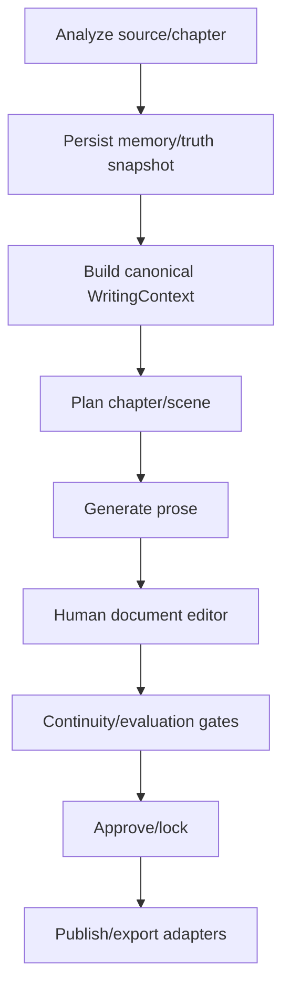

# Writing Pipeline Canonical Map

Issue: #7
Parent epic: #2
Status: Draft inventory and provisional classification
Last updated: 2026-05-01

## Decision Summary

Proposed canonical direction:

```text
analysis -> memory/truth snapshot -> chapter/scene planning -> prose generation -> document editing -> continuity validation -> approval/lock -> publishing handoff
```

Provisional canonical owner should be the chapter-first flow that creates durable chapter draft output through `CHAPTER_WRITE_V3`, then later bridges approved prose into the editor and scene/version model. The current scene workflow remains necessary as compatibility and manual scene-version tooling, but it is not a complete automated writing pipeline.

## Classification Rubric Used

- `keep`: Future canonical or required supporting surface.
- `merge`: Contains required behavior that should move into the canonical path.
- `compatibility-only`: Must remain temporarily for manual recovery, existing UI, or existing data.
- `deprecate`: Not canonical and should receive no new feature work.
- `delete`: Safe to remove after evidence and maintainer sign-off.
- `unknown / needs decision`: Evidence is incomplete; do not implement irreversible changes.

## Evidence Searches

Commands attempted or used for this inventory:

```text
rg --files apps/studio/src/app/api apps/studio/src/features/scenes apps/studio/src/features/autowrite services/memory-bridge
rg -n draft|outline|evaluate|rewrite|lock|autowrite|WRITING_|NARRATIVE_|scene_version|insertVersion|createVersion|llm|LLM|chat|completion|openai|generate|prompt|context ...
Select-String route files for exported HTTP handlers and service calls.
Select-String workflow steps for insertVersion, updateScene, buildCanonGuard, buildStoryContextPack, NARRATIVE_, WRITING_.
Select-String Python workers for process_writing*, process_narrative*, CHAPTER_WRITE_V3, call_llm_json, call_llm_text.
Select-String persistence for insert_scene_with_version, INSERT INTO public.narrative_scene_version, insertVersion, createVersion.
```

Tooling note: `rg` was not executable in this WSL/UNC session because it resolved to the Codex Windows bundle with permission denied. `find`, `grep`, and PowerShell `Select-String` were used for the actual evidence pass.

## API Route Inventory

| Surface | Route file | Handler | Next call | LLM boundary | Durable write boundary | Classification | Evidence / reason |
|---|---|---|---|---|---|---|---|
| Legacy default scene draft | `apps/studio/src/app/api/scenes/draft/route.ts` | `POST` | `postScenesDraftResponse(req, "default")` -> `runDraft` | No direct LLM; stores provided text with guard block | `repoScene.insertVersion` -> `narrative_scene_version`; `updateScene` | compatibility-only | Default-story alias of story-scoped scene workflow; needed for old UI/manual tools, not canonical automation. |
| Story scene draft | `apps/studio/src/app/api/[storySlug]/scenes/draft/route.ts` | `POST` | `postScenesDraftResponse` -> `runDraft` | No direct LLM | `repoScene.insertVersion` | compatibility-only | Manual scene version creation remains useful, but generated writing should not start here. |
| Legacy default scene outline | `apps/studio/src/app/api/scenes/outline/route.ts` | `POST` | `postScenesOutlineResponse` -> `runOutline` | No direct LLM | `repoScene.insertVersion` with beats | compatibility-only | Stores outline/beats for scene workflow only. |
| Story scene outline | `apps/studio/src/app/api/[storySlug]/scenes/outline/route.ts` | `POST` | `postScenesOutlineResponse` -> `runOutline` | No direct LLM | `repoScene.insertVersion` with beats | compatibility-only | Keep only while scene workflow UI exists. |
| Legacy default scene evaluate | `apps/studio/src/app/api/scenes/evaluate/route.ts` | `POST` | `postScenesEvaluateResponse` -> `runEvaluate` | No direct LLM; stub eval builder | `repoScene.updateVersionEval`; `updateScene` | compatibility-only | Evaluation is not real LLM evaluation today. Should merge later into canonical validation. |
| Story scene evaluate | `apps/studio/src/app/api/[storySlug]/scenes/evaluate/route.ts` | `POST` | `postScenesEvaluateResponse` -> `runEvaluate` | No direct LLM; stub eval builder | `repoScene.updateVersionEval`; `updateScene` | merge | Validation concept belongs in canonical flow, current implementation is too local/stubbed. |
| Legacy default scene rewrite | `apps/studio/src/app/api/scenes/rewrite/route.ts` | `POST` | `postScenesRewriteResponse` -> `runRewrite` | No direct LLM; local transform when mode is `llm` | `repoScene.insertVersion`; `updateScene` | compatibility-only | Name suggests LLM rewrite but code builds local rewrite text; keep for manual recovery only. |
| Story scene rewrite | `apps/studio/src/app/api/[storySlug]/scenes/rewrite/route.ts` | `POST` | `postScenesRewriteResponse` -> `runRewrite` | No direct LLM | `repoScene.insertVersion`; `updateScene` | merge | Rewrite UX is needed, but should merge into editor/canonical revision model. |
| Legacy default scene lock | `apps/studio/src/app/api/scenes/lock/route.ts` | `POST` | `postScenesLockResponse` -> `runLock` | None | `repoScene.updateScene(status=LOCKED)` | keep | Approval/lock is a required canonical concept, though implementation may move. |
| Story scene lock | `apps/studio/src/app/api/[storySlug]/scenes/lock/route.ts` | `POST` | `postScenesLockResponse` -> `runLock` | None | `repoScene.updateScene(status=LOCKED)` | keep | Approval/lock should remain conceptually canonical. |
| Story scene unlock | `apps/studio/src/app/api/[storySlug]/scenes/unlock/route.ts` | `POST` | `postScenesUnlockResponse` -> `runUnlock` | None | `repoScene.updateScene(status=DRAFTING)` | compatibility-only | Manual lifecycle tool; useful but not a canonical generation step. |
| Scene intake | `apps/studio/src/app/api/scenes/intake/route.ts`, `apps/studio/src/app/api/[storySlug]/scenes/intake/route.ts` | `POST` | `postScenesIntakeResponse` -> `runIntake` | None | `getOrCreateSceneByWorkunit` -> `narrative_scene` | compatibility-only | Scene creation helper for current UI, not full writing pipeline. |
| Scene versions read | `apps/studio/src/app/api/scenes/[sceneId]/versions/route.ts`, `apps/studio/src/app/api/[storySlug]/scenes/[sceneId]/versions/route.ts` | `GET` | `getSceneVersionsResponse` | None | Read-only | keep | Required history/read surface for scene version model. |
| Commit draft | `apps/studio/src/app/api/scenes/[sceneId]/commit-draft/route.ts`, `apps/studio/src/app/api/[storySlug]/scenes/[sceneId]/commit-draft/route.ts` | `POST` | commit handler in `scenesApiService` | None | `runDraft` / scene-version write path | compatibility-only | Manual editor commit bridge; should later merge with document editor approval. |
| Autowrite v1 run | `apps/studio/src/app/api/[storySlug]/autowrite/run/route.ts` | `POST` | `postAutowriteRunResponse` | Direct TS LLM via `callChatCompletionJson` | Saves final prose through `runDraft` -> `insertVersion` | deprecate | Duplicates writer/critic/judge loop outside worker pipeline and canonical context contract. |
| Legacy autowrite analysis | `apps/studio/src/app/api/[storySlug]/autowrite/pipeline/analysis/route.ts` | `POST` | `createWritingAnalysisTask` | Python worker LLM later | `ingest_job`, `ingest_task(WRITING_ANALYSIS)` | merge | Contains useful analysis/task enqueue path but competes with chapter-first V3. |
| Legacy autowrite execute | `apps/studio/src/app/api/[storySlug]/autowrite/pipeline/execute/route.ts` | `POST` | `executeWritingPhase` | Python worker LLM later | `ingest_task(WRITING_PROSE)` | merge | Concept of approved plan -> prose task belongs in canonical orchestration, current path is legacy. |
| Chapter auto-write | `apps/studio/src/app/api/stories/[slug]/chapters/[chapterId]/auto-write/route.ts` | `POST`, `GET` | story API service / chapter auto-write handlers | Python worker LLM later | `ingest_job`, `ingest_task(CHAPTER_WRITE_V3)` or status reads | keep | Best candidate canonical entry for automated chapter writing. |
| Chapter auto-write retry/status | `apps/studio/src/app/api/stories/[slug]/chapters/[chapterId]/auto-write/retry/route.ts`, `.../status/route.ts` | `POST`, `GET` | story API service / status handlers | Python worker LLM later | Worker task/status tables | keep | Operational support for chapter-first generation. |
| Chapter plan/write via scene API service | no single route; `scenesApiService` exposes chapter planning/writing branches | `POST` routes in chapter/scenes surfaces | `runChapterPlanning`, `runChapterWriting` | TS planning LLM and Python narrative tasks | `ingest_job`, `ingest_task(NARRATIVE_START)` | merge | Valuable planning and narrative task launch, but route ownership is spread across scene API service. |
| Muse prose/synthesis/compress | `apps/studio/src/app/api/muse/chat/prose/route.ts`, `synthesis/route.ts`, `compress/route.ts` | `POST` | `callChatCompletionJson` | Direct TS LLM | No durable prose write by route | compatibility-only | Editor assist path, not canonical autonomous writing; should later belong to document editor assist. |
| Draft stream pipeline | `apps/studio/src/app/api/pipeline/draft/stream/route.ts` | `POST` | `postDraftStreamResponse` | Unknown in this pass | Unknown | unknown / needs decision | Found as write-like route, but not traced in this pass. |

## TypeScript Service Inventory

| File | Functions / responsibility | Next call | LLM boundary | DB write boundary | Classification | Evidence / reason |
|---|---|---|---|---|---|---|
| `apps/studio/src/features/scenes/server/scenesApiService.ts` | API facade for scenes, chapter planning/writing, ingest/split bridge | Calls `runDraft`, `runOutline`, `runRewrite`, `runEvaluate`, `runLock`, `runUnlock`, `runChapterPlanning`, `runChapterWriting` | Indirect via chapter planning/writing | Multiple direct `INSERT`/`UPDATE` into source docs, ingest jobs/tasks, staging | merge | Too broad; should be split by canonical orchestration, scene lifecycle, and ingest bridge. |
| `apps/studio/src/features/scenes/server/workflow/steps/draft.ts` | `runDraft` writes a draft scene version with canon guard block | `buildCanonGuard`, `insertVersion`, `updateScene` | No direct LLM | `narrative_scene_version`, `narrative_scene` | compatibility-only | Good manual version writer; not autonomous writing. |
| `apps/studio/src/features/scenes/server/workflow/steps/outline.ts` | `runOutline` writes outline/beats version | `insertVersion`, `updateScene` | No direct LLM | `narrative_scene_version`, `narrative_scene` | compatibility-only | Manual scene-outline storage. |
| `apps/studio/src/features/scenes/server/workflow/steps/evaluate.ts` | `runEvaluate` stores stub eval JSON | `updateVersionEval`, `updateScene` | No direct LLM | `narrative_scene_version.eval_json`, `narrative_scene` | merge | Validation concept needed, implementation should be replaced by canonical evaluator. |
| `apps/studio/src/features/scenes/server/workflow/steps/rewrite.ts` | `runRewrite` creates revised version from current text/manual text | `buildCanonGuard`, `insertVersion`, `updateScene` | No direct LLM | `narrative_scene_version`, `narrative_scene` | merge | Rewrite belongs to editor/revision model. |
| `apps/studio/src/features/scenes/server/workflow/steps/lock.ts` | `runLock` sets scene status locked | `updateScene` | None | `narrative_scene.status` | keep | Approval/lock concept remains canonical. |
| `apps/studio/src/features/scenes/server/workflow/steps/unlock.ts` | `runUnlock` returns locked scene to drafting | `updateScene` | None | `narrative_scene.status` | compatibility-only | Operational/manual lifecycle only. |
| `apps/studio/src/features/scenes/server/workflow/steps/intake.ts` | `runIntake` creates/fetches scene by workunit | `getOrCreateSceneByWorkunit` | None | `narrative_scene` | compatibility-only | Scene shell creation utility. |
| `apps/studio/src/features/scenes/server/workflow/steps/chapterPlanning.ts` | `runChapterPlanning`, `buildPlanningMemoryPackV5`, `renderPlanningPrompt` | `buildStoryContextPack`, `callChatCompletionJson` | Direct TS LLM | No durable prose; reads snapshots/context | keep | Planning is part of canonical flow; should consume future `WritingContext`. |
| `apps/studio/src/features/scenes/server/workflow/steps/chapterWriting.ts` | `runChapterWriting` enqueues `NARRATIVE_START` | `ensureIngestWorkerRunning` | Python worker later | `ingest_job`, `ingest_task` | merge | Launches narrative worker flow but overlaps `writingPipelineService.enqueueChapterWriteV3`. |
| `apps/studio/src/features/scenes/server/workflow/repoScene.ts` | Scene repository and active TS `insertVersion` | SQL queries | None | Active `narrative_scene_version` write | keep | Current durable scene-version writer. |
| `apps/studio/src/features/scenes/server/workflow/versionRepo.ts` | Alternate `VersionRepo.createVersion` | SQL insert | None | Alternate `narrative_scene_version` write without `story_id` | deprecate | Appears older/dormant versus active `repoScene.insertVersion`; needs call-site confirmation before deletion. |
| `apps/studio/src/features/autowrite/server/autowriteRunService.ts` | Direct writer/critic/judge autowrite loop | `buildStoryContextPack`, prompt builders, `callChatCompletionJson`, `runDraft` | Direct TS LLM, multiple calls | Final save through `runDraft` -> `insertVersion` | deprecate | Duplicate generation path outside canonical worker/task model. |
| `apps/studio/src/features/autowrite/server/writingPipelineService.ts` | Legacy and V3 task orchestration | Enqueues `WRITING_*`, `NARRATIVE_*`, `CHAPTER_WRITE_V3` | Python worker later | `ingest_job`, `ingest_task`, some staging/status tables | merge | Contains key orchestration but has multiple competing flows in one file. |
| `apps/studio/src/features/autowrite/server/narrativeWorkerService.ts` | TS poller for `NARRATIVE_%` tasks | `processNarrativeTask` | TS executor later | `ingest_task` status | deprecate | Competes with Python worker, which also handles `NARRATIVE_*`. |
| `apps/studio/src/features/autowrite/server/narrativeTaskExecutor.ts` | TS executor for `NARRATIVE_*` tasks | `buildStoryContextPack`; local placeholder prose steps | No real external LLM in this pass | `narrative_chapter_staging`, `ingest_task`, `ingest_job` | deprecate | Duplicate implementation of Python narrative handlers. |
| `apps/studio/src/features/autowrite/server/chapterContextService.ts` | `buildWorkingSet` for chapter context | DB reads | None | Read-only | merge | Context assembly should feed canonical `WritingContext`. |
| `apps/studio/src/features/autowrite/server/virtualSceneProvider.ts` | Parses virtual scenes from chapter draft text | Called by `scenesApiService` list bridge | None | Read-only | compatibility-only | Bridge for V3 draft display in legacy scene UI. |

## Python Worker Inventory

| Task / surface | File | Function | Data received | Data emitted / writes | LLM boundary | Classification | Evidence / reason |
|---|---|---|---|---|---|---|---|
| Worker dispatch | `services/memory-bridge/memory_bridge_worker.py` | `run_worker` task switch | `ingest_task.payload_json` | Marks task done/failed through repo helpers | Indirect | keep | Central Python boundary for task execution. |
| Task claiming and scene persistence | `services/memory-bridge/worker_ingest_repo.py` | `claim_next_task`, `insert_scene_with_version`, `mark_task_*` | DB task rows | `narrative_scene`, `narrative_scene_version`, task status | None | keep | Active DB boundary; writes scene versions during ingest/split path. |
| `WRITING_ANALYSIS` | `services/memory-bridge/worker_task_handlers.py`, `worker_writing_analysis.py` | `process_writing_analysis_task` -> analysis helpers | instructions, chapter_id, profile/policy/context | `writing_analysis_staging`, `writing_snapshot_v3`, follow-up tasks | `call_llm_json` | merge | Strong analysis and snapshot behavior, but tied to legacy autowrite flow. |
| `WRITING_PLANNING` | `worker_task_handlers.py`, `worker_writing_planning.py` | `process_writing_planning_task`, `generate_beat_map` | analysis_result, instructions | `ingest_task.result_json` with plan | `call_llm_json` | merge | Planning concept needed, but TS `runChapterPlanning` also exists. |
| `WRITING_PROSE` | `worker_task_handlers.py`, `worker_writing_prose.py` | `process_writing_prose_task`, `generate_prose_with_snapshot` | beat, scene info, truth context pack | `ingest_task.result_json` prose | `call_llm_json` | merge | Prose generation concept needed, but output does not directly own final document model. |
| `WRITING_CONTINUITY` | `worker_task_handlers.py`, `worker_writing_continuity.py` | `process_writing_continuity_task` | prose result and continuity state | `narrative_scene_state`, task result | `call_llm_json` | merge | Continuity validation belongs in canonical flow. |
| `WRITING_SUPERVISOR` | `worker_task_handlers.py`, `worker_writing_supervisor.py` | `process_writing_supervisor_task` | pipeline results | task result/supervisor output | `call_llm_json` | merge | Supervision/evaluation needed but should be unified with canonical gates. |
| `CHAPTER_WRITE_V3` | `worker_task_handlers.py`, `worker_chapter_writer.py` | `process_chapter_write_v3_task`, `generate_chapter_v3` | job_config, working_set, instructions | `chapter_draft` | `call_llm_json` | keep | Best current canonical chapter-first generation endpoint. |
| `CHAPTER_LEDGER_EXTRACT` | `worker_task_handlers.py`, `worker_chapter_ledger_extractor.py` | `process_chapter_ledger_task` | chapter draft/prose | `chapter_ledger`, continuity issues | `call_llm_json` | keep | Required for long-story consistency if chapter-first path is canonical. |
| `MEMORY_ROLLUP_V3` | `worker_task_handlers.py`, `worker_memory_rollup_v3.py` | `process_memory_rollup_v3_task` | ledger/memory inputs | rollup memory tables | `call_llm_json` | keep | Required memory progression for canonical flow. |
| `NARRATIVE_START` | `worker_narrative_handlers.py` | `process_narrative_start_task` | plan/job payload | enqueues `NARRATIVE_STYLIST` | None | merge | Useful multi-agent sequence, but overlaps `CHAPTER_WRITE_V3`. |
| `NARRATIVE_STYLIST` | `worker_narrative_handlers.py` | `process_narrative_stylist_task` | beat payload, context block, prior prose | prose in task payload/result; enqueues critic | `call_llm_text` | merge | Useful stylist stage, but output should feed canonical draft/document model. |
| `NARRATIVE_CRITIC` | `worker_narrative_handlers.py` | `process_narrative_critic_task` | prose and rubric/context | critique result; may enqueue refine | `call_llm_json` | merge | Critic behavior should become canonical validation/evaluation stage. |
| `NARRATIVE_REFINE` | `worker_narrative_handlers.py` | `process_narrative_refine_task` | prose + critique | refined prose; enqueues next/finalize | `call_llm_text` | merge | Refinement belongs in canonical generation loop if retained. |
| `NARRATIVE_FINALIZE` | `worker_narrative_handlers.py` | `process_narrative_finalize_task` | final prose payload | `narrative_chapter_staging` | None | merge | Finalization should write canonical draft/document output, not separate staging forever. |

## Context And Prompt Builders

| File | Function(s) | Inputs covered | LLM-facing output | Classification | Notes |
|---|---|---|---|---|---|
| `apps/studio/src/features/guard/server/storyContextBuilder.ts` | `buildStoryContextPack` | worldbuilding, canon, relationships, timeline, style lines, local prose tail, bridge signals | `StoryContextPack` line arrays | merge | Important context source, but should adapt to a central `WritingContext`. |
| `apps/studio/src/features/guard/server/canonGuard.ts` | `buildCanonGuard` | `StoryContextPack`, scene/workunit, keywords, token budget | guard block with world/canon/relationship/recent events/uncertainty | merge | Guard is useful, but current string block should not be the only contract. |
| `apps/studio/src/features/prompts/server/autowritePromptBuilder.ts` | `renderAutowriteContextBlock`, writer/critic/judge prompts | story context pack and autowrite config | writer/critic/judge prompts | deprecate | Bound to autowrite v1 direct loop. Keep ideas, not path. |
| `apps/studio/src/features/prompts/server/narrativePromptBuilder.ts` | stylist/editorial prompts | chapter/beat/context inputs | narrative prompts | merge | Useful if narrative multi-agent flow is retained. |
| `apps/studio/src/features/analysis/server/truthPackGovernance.ts` | `buildPreChapterProfileV1`, `compileTruthContextPackV1` | timeline mode, author annotations, priority rules, canonical facts | truth context pack/profile | keep | Strong candidate for canonical context governance. |
| `apps/studio/src/features/scenes/server/workflow/steps/chapterPlanning.ts` | `buildPlanningMemoryPackV5`, `renderPlanningPrompt` | active snapshots, scope snapshots, scene facts, story context fallback, canon delta | planning prompt | keep | Current strongest TS planning path, but huge and should be decomposed after map approval. |
| `services/memory-bridge/worker_memory_context.py` | `build_planning_context_v5`, `build_prose_context_v5` | active snapshots, narrative scenes, scope snapshots, canon/timeline facts | Python planning/prose context dicts | merge | Python-side context duplicates TS context assembly. Must align through one contract. |
| `services/memory-bridge/worker_writing_planning.py` | `generate_beat_map` prompt construction | analysis result, instructions, dictionary rules | JSON beat map prompt | merge | Should consume canonical context. |
| `services/memory-bridge/worker_writing_prose.py` | `generate_prose_with_snapshot` prompt construction | beat, prior state, truth snapshot, dictionary rules | JSON prose prompt | merge | Should consume canonical context and write to canonical draft target. |
| `services/memory-bridge/worker_narrative_handlers.py` | narrative stylist/critic/refine prompts | task payload, context blocks, prose | text/json LLM calls | merge | Multi-agent narrative stages need ownership decision. |

## LLM Boundaries

| Boundary | File | Function | Provider call | Classification |
|---|---|---|---|---|
| TS Muse shared LLM | `apps/studio/src/app/api/muse/_shared.ts` | `callChatCompletionJson` | `fetch(${LLM_API_BASE}/chat/completions)` | keep as shared adapter; move product ownership above it |
| TS chapter planning | `chapterPlanning.ts` | `runChapterPlanning` | `callChatCompletionJson` | keep |
| TS chapter writing/narrative prompts | `chapterWriting.ts` | imported prompt + `callChatCompletionJson` references | TS LLM or Python queued depending path | merge |
| TS autowrite v1 | `autowriteRunService.ts` | writer/critic/judge calls | `callChatCompletionJson` | deprecate |
| Python worker common | `services/memory-bridge/worker_common.py` | `call_llm_json`, `call_llm_text`, `call_llm_embedding` | `${DEFAULT_LLM_BASE}/chat/completions`, embeddings endpoint | keep |
| Python writing analysis | `worker_writing_analysis.py` | `_extract_candidate_facts_llm` | `call_llm_json` | merge |
| Python writing planning | `worker_writing_planning.py` | `generate_beat_map` | `call_llm_json` | merge |
| Python writing prose | `worker_writing_prose.py` | `generate_prose_with_snapshot` | `call_llm_json` | merge |
| Python continuity | `worker_writing_continuity.py` | extract/integrity calls | `call_llm_json` | merge |
| Python supervisor | `worker_writing_supervisor.py` | supervisor call | `call_llm_json` | merge |
| Python chapter V3 | `worker_chapter_writer.py` | `generate_chapter_v3` | `call_llm_json` | keep |
| Python narrative multi-agent | `worker_narrative_handlers.py` | stylist/critic/refine | `call_llm_text`, `call_llm_json` | merge |

## Durable Write Boundaries

| Data | File | Function / SQL | Classification | Notes |
|---|---|---|---|---|
| `narrative_scene_version` active TS write | `apps/studio/src/features/scenes/server/workflow/repoScene.ts` | `insertVersion` | keep | Current scene-version commit path for draft/outline/rewrite. |
| `narrative_scene_version` alternate TS write | `apps/studio/src/features/scenes/server/workflow/versionRepo.ts` | `VersionRepo.createVersion` | deprecate | Appears older/dormant; lacks `story_id` in insert column list. Needs call-site check before removal. |
| `narrative_scene_version` Python ingest write | `services/memory-bridge/worker_ingest_repo.py` | `insert_scene_with_version` | keep | Used by ingest/split scene creation and `SCENE_CREATE`. |
| `chapter_draft` | `services/memory-bridge/worker_task_handlers.py` | `process_chapter_write_v3_task` insert | keep | Current chapter-first generated prose store. |
| `narrative_chapter_staging` | `apps/studio/src/features/autowrite/server/narrativeTaskExecutor.ts`, `services/memory-bridge/worker_narrative_handlers.py`, `scenesApiService.ts` | final/staging inserts | merge | Transitional staging; should be reconciled with document editor and chapter draft ownership. |
| `writing_snapshot_v3` | `services/memory-bridge/worker_task_handlers.py` | `process_writing_analysis_task` insert | keep | Important memory/truth snapshot for generation. |
| `writing_scope_snapshot_v1` | `services/memory-bridge/worker_memory_rollup.py`, `historianAnalysisService.ts` | rollup/activation writes | keep | Needed for long-range memory. |
| `ingest_job`, `ingest_task` | `writingPipelineService.ts`, `chapterWriting.ts`, `scenesApiService.ts`, Python repo | queue orchestration | keep | Canonical worker queue can stay, but task taxonomy must be simplified. |

## Proposed Canonical Flow



Recommended near-term path:

1. Keep `CHAPTER_WRITE_V3` as the initial canonical automated prose entry.
2. Keep `writing_snapshot_v3` / scope snapshots as memory inputs until #3 defines the central contract.
3. Merge useful planning/continuity/narrative critic behavior into one orchestration model.
4. Keep scene workflow as compatibility/manual version history until the document editor model is defined.
5. Deprecate direct TS autowrite v1 and TS narrative task executor after replacement paths exist.

## Unknown / Needs Decision

- `apps/studio/src/app/api/pipeline/draft/stream/route.ts`: found as draft-like route but not traced in this pass.
- Exact route/service ownership for `apps/studio/src/app/api/stories/[slug]/chapters/[chapterId]/plan/route.ts` and execute/control routes should be traced before implementation work.
- Whether `NARRATIVE_*` multi-agent stages should be kept as canonical stages or merged into `CHAPTER_WRITE_V3` worker internals.
- Whether `chapter_draft`, `narrative_chapter_staging`, or future document blocks become the durable generated-prose source of truth.
- Existing uncommitted working-tree files include new writing-related files; their intended ownership should be confirmed before final approval.

## Follow-Up Issues To Create After Approval

- `[Feature][AI] Define canonical WritingContext adapter from TS and Python context builders`.
- `[Task][BE] Mark direct autowrite v1 path deprecated and block new feature work`.
- `[Task][BE] Decide and consolidate TS vs Python NARRATIVE_* executors`.
- `[Task][DB] Decide prose source of truth: chapter_draft vs scene_version vs document blocks`.
- `[Task][FE] Bridge scene-version compatibility UI to future document editor model`.

## Maintainer Approval

Approval status: pending.

Approver:

Decision date:

Notes:
